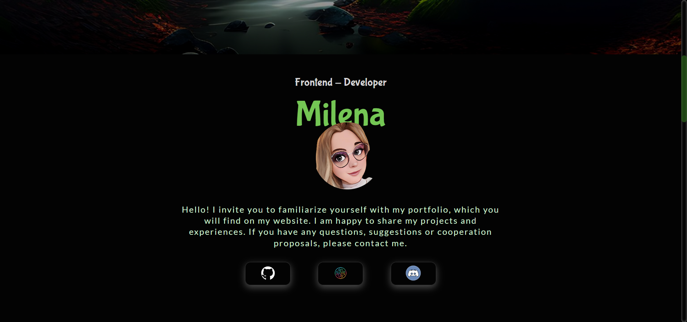

# Project Portfolio

:fire: **Milena's Portfolio** :fire:

Project portfolio is a meticulously crafted portfolio that showcases the
professional journey and accomplishments of me. This portfolio serves as a
comprehensive reflection of my skills, experiences, and expertise in
programming.

Through a visually engaging and user-friendly interface, visitors can explore a
diverse range of projects, case studies, and notable achievements that highlight
my capabilities and creative problem-solving approach.

With a clear focus on professionalism and attention to detail, that site offers
a compelling narrative that effectively communicates my unique value proposition
and establishes a strong online presence, making it a valuable resource for
potential clients, collaborators, and employers alike.

## Table of contents 🗒️

- [Name of project](#project-portfolio)
  - [Table of contents](#table-of-contents-🗒️)
  - [General info](#general-info)
  - [Screenshots](#screenshots-📸)
  - [Status](#status-⌛)
  - [Inspiration](#inspiration-💭)
  - [Technologies](#technologies-🖥️)
  - [Instructions for use](#how-to-run-the-website-locally-📂)
  - [Contribution](#contribution-❤️)
  - [Code Quality Checks](#code-quality-checks-✔️)
  - [Links](#links-🌐)
  - [Contact](#contact-💌)

## General info

> I invite you to familiarize yourself with my portfolio, which you will find on
> my website. I am happy to share my projects and experiences. If you have any
> questions, suggestions or cooperation proposals, please contact me.

## Screenshots 📸

## Status ⌛

Project is: _done_

## Inspiration 💭

Project inspired by my imagination

## Technologies 🖥️

The HackYourFuture Belgium website was built using the following technologies:

- HTML
- CSS
- Git
- Node 19.4.0
- JavaScript

The website is responsive and works on different devices, including computers,
tablets, and smartphones.

## How to Run the Website Locally 📂

To run the HackYourFuture Belgium website locally on your computer, follow these
steps:

1. Make sure you have Node.js installed on your computer.
2. Clone the GitHub repository (link to clone)
3. Navigate to the hack-your-future-belgium directory in your terminal.
4. Run the command `npm install` to install the required packages.
5. Run the command `npm start` to start the server and open the website in your
   browser.

## Contribution ❤️

If you have any valuable comments on my project, all constructive comments are
greatly appreciated :pray:

## Code Quality Checks ✔️

- `npm run format`: Makes sure all the code in this repository is well-formatted
  (looks good).
- `npm run lint:ls`: Checks to make sure all folder and file names match the
  repository conventions.
- `npm run lint:md`: Will lint all of the Markdown files in this repository.
- `npm run lint:css`: Will lint all of the CSS files in this repository.
- `npm run validate:html`: Validates all HTML files in your project.
- `npm run spell-check`: Goes through all the files in this repository looking
  for words it doesn't recognize. Just because it says something is a mistake
  doesn't mean it is! It doesn't know every word in the world. You can add new
  correct words to the [./.cspell.json](./.cspell.json) file so they won't cause
  an error.

## Links 🌐

[Repo](https://github.com/Mileenka/Portfolio)

[Live](https://mileenka.github.io/Portfolio/)

## Contact 💌

---

| [Milena](https://github.com/Mileenka) |
